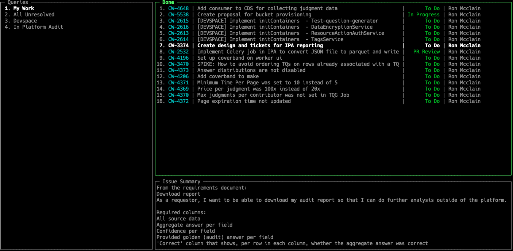

# Description
This is a simple terminal Jira viewer.  Configure JQL queries in a config file and you will
be able to view issues and easily open them in a browser for editing.

# Screenshot


# Installation
go get github.com/mixtli/jiraterm

Get an API Token.  See: [here](https://confluence.atlassian.com/cloud/api-tokens-938839638.html)


# Config file ( ~/.config/jiraterm/config.yml )

```
endpoint: https://yourdomain.atlassian.net
email: your@email.com
api_key: yourapikey

queries:
  - name: My Work
    query: resolution = unresolved and assignee=currentuser() ORDER BY priority asc, created
  - name: All Unresolved
    query: resolution = unresolved ORDER BY priority asc, created
```

# Key Mappings
|Key|Function|
|---|--------|
|h|Query List|
|l|Issue List|
|k| Up |
|j| Down |
|v| View Issue |
|o| Open Issue in Browser |
|s| Search in View |
|r| Reset View (clears search) |

